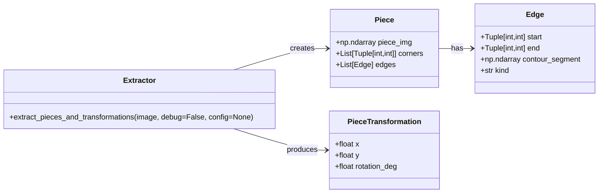
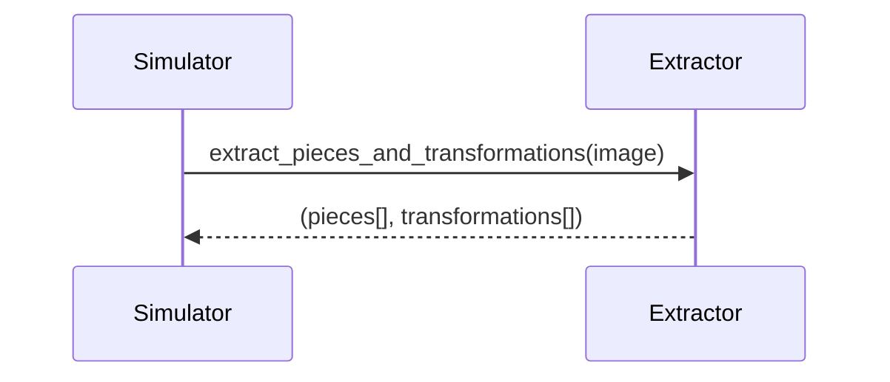

# Puzzle Piece Extractor – API Specification

## Einleitung

Diese API extrahiert **Puzzle-Teile** aus einem Eingangsbild und liefert:  
1. Eine Liste von `Piece`-Objekten mit Bild, Ecken und Kanten  
2. Eine Liste von `PieceTransformation`-Objekten mit Position und Rotation  

Schnittstelle für Simulator und Extraktor ist klar getrennt.

## Public API

```python
from typing import List, Tuple
import numpy as np

Image = np.ndarray
Point = Tuple[int, int]

class Edge:
    """Represents one side between two corners."""
    def __init__(self, start: Point, end: Point, contour_segment: np.ndarray, kind: str):
        self.start = start
        self.end = end
        self.contour_segment = contour_segment  # Nx2 array of contour points
        self.kind = kind                        # 'flat' | 'innie' | 'outie'

class Piece:
    """Represents one puzzle piece with local geometry."""
    def __init__(self, piece_img: Image, corners: List[Point], edges: List[Edge]):
        self.piece_img = piece_img
        self.corners = corners
        self.edges = edges

class PieceTransformation:
    """Global transform of a piece in scene coordinates."""
    def __init__(self, x: float, y: float, rotation_deg: float):
        self.x = x
        self.y = y
        self.rotation_deg = rotation_deg

class Extractor:
    def extract_pieces_and_transformations(
        image: Image,
        *,
        debug: bool = False,
        config: dict = None
    ) -> Tuple[List[Piece], List[PieceTransformation]]:
        """
        Main API: (image) -> (pieces[], transformations[])
    
        Args:
            image: Input image (np.ndarray)
            debug: If True, show debug visualizations
            config: Optional dict with tuning parameters
    
        Returns:
            Tuple (List[Piece], List[PieceTransformation])
        """
        pass
````

## Klassendiagramm



## Sequenzdiagramm



## Beispiel

```python
img = cv2.imread("puzzle_scene.jpg")
extractor = Extractor()
pieces, transforms = extractor.extract_pieces_and_transformations(img)

for p, t in zip(pieces, transforms):
    print(f"Piece at ({t.x:.1f}, {t.y:.1f}) rot={t.rotation_deg:.1f}°")
```
