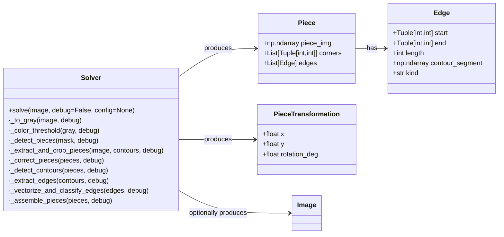
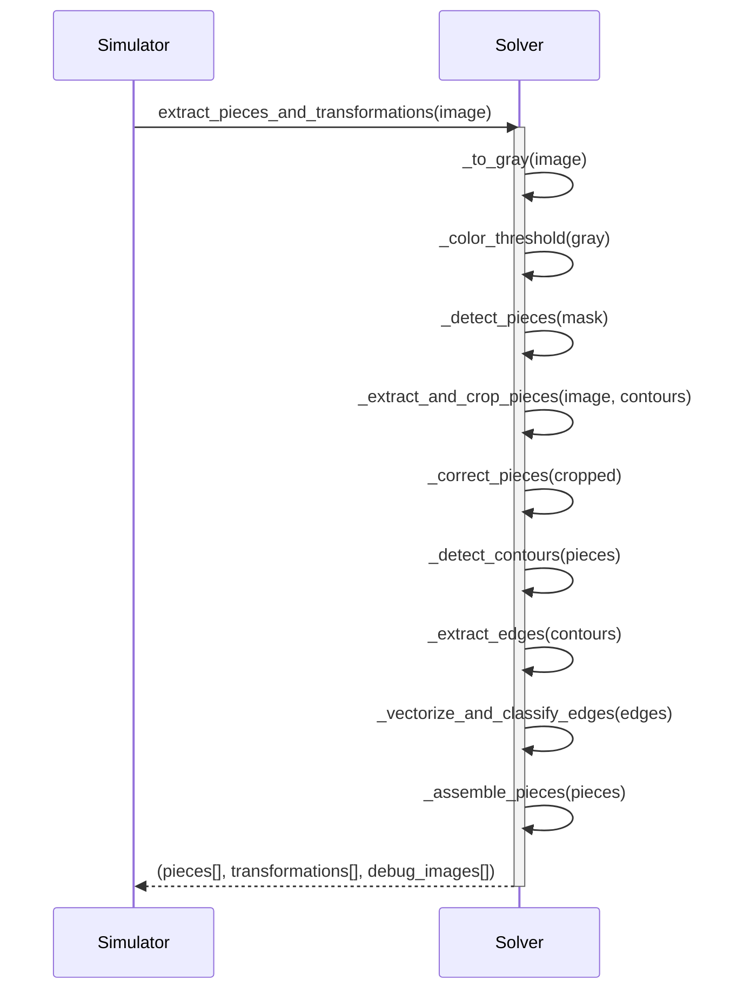

# Puzzle Piece Solver – API Specification

## Einleitung

Diese API extrahiert **Puzzle-Teile** aus einem Eingangsbild über eine klar strukturierte Pipeline.
Jede Stufe kann optional ein Debug-Bild zurückgeben, um den Fortschritt visuell zu prüfen.

Die Pipeline führt folgende Schritte aus:

1. Graustufen-Umwandlung
2. Color Thresholding
3. Stück-Erkennung
4. Ausschneiden der Stücke
5. Korrektur / Normalisierung
6. Konturerkennung pro Puzzleteil
7. Kantensegment-Extraktion
8. Vektorisierung & Klassifikation der Kanten
9. Zusammenbau der Teile

Die Hauptschnittstelle `extract_pieces_and_transformations()` ruft diese Methoden sequentiell auf.

## Public API

```python
from typing import List, Tuple, Optional
import numpy as np

Image = np.ndarray
Point = Tuple[int, int]


class Edge:
    """Represents one side between two corners."""
    def __init__(self, start: Point, end: Point, contour_segment: np.ndarray, length: int, kind: str):
        self.start = start
        self.end = end
        self.contour_segment = contour_segment  # Nx2 array of contour points
        self.kind = kind                        # 'flat' | 'innie' | 'outie'
        self.length = length


class Piece:
    """Represents one puzzle piece with local geometry."""
    def __init__(self, piece_img: Image, corners: List[Point], edges: List[Edge]):
        self.piece_img = piece_img
        self.corners = corners
        self.edges = edges


class PieceTransformation:
    """Global transform of a piece in scene coordinates."""
    def __init__(self, x: float, y: float, rotation_deg: float):
        self.x = x
        self.y = y
        self.rotation_deg = rotation_deg


class Solver:
    """Pipeline-based puzzle piece Solver."""

    def solve(
        self,
        image: Image,
        *,
        debug: bool = False,
        config: Optional[dict] = None
    ) -> Tuple[List[Piece], List[PieceTransformation], Optional[List[Image]]:
        """
        Main API: (image) -> (pieces[], transformations[], debug_images[])
        Executes the full pipeline sequentially.
        """
        pass

    # ---- Intermediate pipeline stages ----

    def _to_gray(self, image: Image, debug: bool) -> Tuple[Image, Optional[Image]]:
        """Convert input to grayscale."""

    def _color_threshold(self, gray: Image, debug: bool) -> Tuple[Image, Optional[Image]]:
        """Apply color thresholding to isolate puzzle regions."""

    def _detect_pieces(self, mask: Image, debug: bool) -> Tuple[List[np.ndarray], Optional[Image]]:
        """Detect piece regions in the thresholded mask."""

    def _extract_and_crop_pieces(
        self, image: Image, contours: List[np.ndarray], debug: bool
    ) -> Tuple[List[Image], Optional[Image]]:
        """Extract and crop puzzle pieces from original image."""

    def _correct_pieces(self, cropped_pieces: List[Image], debug: bool) -> Tuple[List[Image], Optional[Image]]:
        """Correct orientation, normalize size, and clean edges."""

    def _detect_contours(self, pieces: List[Image], debug: bool) -> Tuple[List[np.ndarray], Optional[Image]]:
        """Detect contours for each individual piece."""

    def _extract_edges(self, contours: List[np.ndarray], debug: bool) -> Tuple[List[List[Edge]], Optional[Image]]:
        """Extract edge segments between corners."""

    def _vectorize_and_classify_edges(
        self, edges: List[List[Edge]], debug: bool
    ) -> Tuple[List[Piece], Optional[Image]]:
        """Convert contour edges into vectorized, labeled Edge objects."""

    def _assemble_pieces(
        self, pieces: List[Piece], debug: bool
    ) -> Tuple[List[Piece], List[PieceTransformation], Optional[Image]]:
        """Estimate global transformations and assemble output."""
```

## Klassendiagramm



## Sequenzdiagramm



## Beispiel

```python
img = cv2.imread("puzzle_scene.jpg")
solver = Solver()
pieces, transforms, debug_images = solver.solve(img, debug=True)

# In the simulator show one debug image after the other
for i in debug_images:
    show_image(i)

# For the actual product the transformations need to be processed
for p, t in zip(pieces, transforms):
    move_to(t.x, t.y)
    lift()
    turn(t.rotation_deg)
    move_to(t.x, t.y)
    lower()
```
